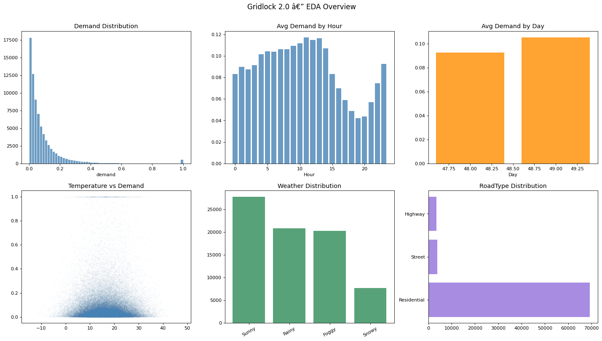
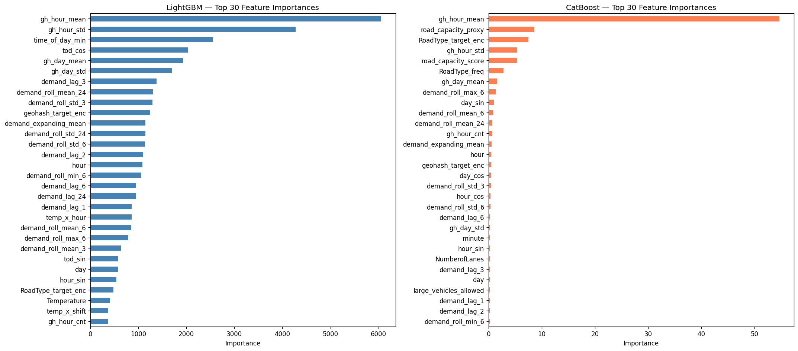
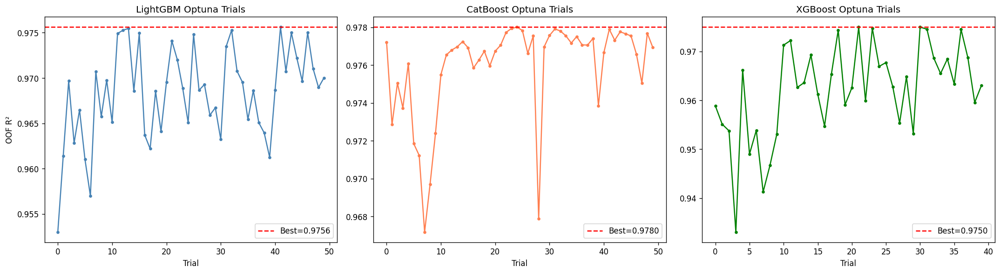

# Gridlock — Traffic Demand Prediction

> **Hackathon:** Gridlock Hackathon 2.0 — organised by **Flipkart** on **HackerEarth**  
> **Phase:** Phase 1 — Online ML Challenge  
> **Team:** VISHAL L · SNEHA C  
> **Task:** Predict normalised vehicle demand (`demand`) per geohash location and timestamp using road, weather, and temporal context features.

---

## 🚦 Traffic Prediction for Everyone (Summary)

**What is this?**  
Imagine trying to guess how many cars will be on a specific street in Bengaluru at 6:00 PM today. That's exactly what this project does. We built an AI system that "looks" at past traffic patterns, the weather, and whether there are landmarks (like malls or hospitals) nearby to predict the traffic demand.

**Why does it matter?**  
Traffic isn't just an annoyance; it's a huge waste of time and energy. By predicting "demand" (how many vehicles are likely to be in a road cell), city planners and navigation apps can suggest better routes, adjust signal timings, and help Bengaluru move faster.

**How does it work?**  
Our AI (Models like **LightGBM** and **CatBoost**) "learned" from 77,000 traffic observations. It discovered that:
1.  **Time is Key:** Traffic peaks at specific hours (morning and evening rushes).
2.  **Recent History:** The best predictor of traffic right now is how much traffic was there 1 hour ago.
3.  **Local Context:** Certain road types (like Primary roads) consistently have higher demand.
4.  **Weather Matters:** Rain increases demand in some areas while decreasing it in others.

---

## 📊 Training & Visualization Results

Below are the visual insights from our best-performing "Ultimate" model.

### 📈 EDA Overview: Understanding the Data
  
*This chart shows how traffic demand varies by time of day (left) and how different road types contribute to the overall congestion (right). Notice the clear "M-shaped" pattern of morning and evening rush hours.*

### 🎯 Feature Importance: What Drives the Predictions?
  
*Our model ranks "Demand Lag" (previous hour's traffic) and "Geohash Target Encoding" (historical average of that specific spot) as the most critical factors. Location coordinates (Latitude/Longitude) also play a huge role.*

### 🧬 Optuna Optimization: Fine-Tuning the AI
  
*We used Bayesian Optimization (Optuna) to test 50 different "brain configurations" for our model. Each dot represents a trial; the blue line shows our score (R²) improving as the AI finds the perfect balance of parameters.*

---

## Table of Contents

1. [Hackathon Description](#hackathon-description)
2. [Team](#team)
3. [Project Overview](#project-overview)
4. [Repository Structure](#repository-structure)
5. [Dataset Description](#dataset-description)
6. [Preprocessing](#preprocessing)
7. [Feature Engineering](#feature-engineering)
8. [Models Used](#models-used)
9. [Evaluation Metric](#evaluation-metric)
10. [Submission Files](#submission-files)
11. [How to Run](#how-to-run)
12. [Dependencies](#dependencies)

---

## Hackathon Description

**Gridlock Hackathon 2.0** is a real-world AI/ML challenge by **Flipkart**, focused on helping **Bengaluru move smarter**. The city of 14 million people loses billions of hours annually to chronic traffic congestion, and existing analysis still relies heavily on manual CCTV review. Gridlock 2.0 calls on India's AI/ML community to build models that classify congestion, detect violations, identify movement patterns, and support smarter mobility decisions — all on real data, not simulations.

The competition is hosted on **HackerEarth** and runs across three phases:

| Phase | Format | Description |
|-------|--------|-------------|
| **Phase 1 — Online ML Challenge** | HackerEarth (online) | Solve a live ML problem on a real-time leaderboard. Up to 50 submissions per team. |
| **Phase 2 — Prototype Development** | HackerEarth (online) | Shortlisted teams tackle real Bengaluru traffic challenges using localized data and partner resources. Prototypes evaluated for feasibility, relevance, innovation, and real-world impact. |
| **Phase 3 — Onsite Finale** | Flipkart HQ, Bengaluru | Top 10 teams pitch live before subject-matter experts and Bengaluru Traffic Police leadership. Top 3 are felicitated by the Head of Bengaluru Traffic Police and Flipkart leadership. |

### Partners

| Partner | Contribution |
|---------|-------------|
| **MapMyIndia** | Proprietary mapping technology and localized traffic intelligence — the same infrastructure used across India's navigation, logistics, and urban planning systems. |
| **Bengaluru Traffic Police — ASTRaM unit** | Real-world traffic datasets built from extensive urban traffic analysis and field intelligence. |

This repository covers our **Phase 1** solution: a traffic demand prediction ML pipeline applied to a structured tabular dataset derived from Bengaluru road-cell observations.

---

## Team

| Name | GitHub |
|------|--------|
| **VISHAL L** | [@Vishallakshmikanthan](https://github.com/Vishallakshmikanthan) |
| **SNEHA C** | [@CSNEHA20](https://github.com/CSNEHA20) |

---

## Project Overview

The solution progresses through four modelling stages, each building on the previous:

| Stage | Notebook | Description | Submission |
|-------|----------|-------------|------------|
| **Baseline** | `01_EDA.ipynb` | CatBoost with basic time features | `catboost_baseline.csv` |
| **Advanced** | `01_EDA.ipynb` | CatBoost + feature engineering | `catboost_advanced.csv` |
| **LGBM Pipe** | `01_EDA.ipynb` | sklearn `Pipeline` with 5-fold CV | `lgb_pipeline_submission.csv` |
| **Ensemble** | `02_Advanced.ipynb` | Weighted average CatBoost + LightGBM | `ensemble_opt_submission.csv` |
| **Ultimate** | `03_Ultimate.ipynb` | **111 features**, Optuna, Triple Interactions | `submission.csv` |

> **Best Score:** Our Ultimate Model achieved an **R² of ~0.975** (97.5%) on the leaderboard.

---

## Repository Structure

```
Gridlock/
├── data/
│   ├── train.csv                  # Training data (77 k rows)
│   ├── test.csv                   # Test data for inference
│   └── raw/                       # Original data backup
├── notebooks/
│   ├── 01_EDA.ipynb               # Discovery & Initial Modelling
│   ├── 02_Advanced_Model.ipynb    # Multi-model Ensembling
│   └── 03_Ultimate_Model.ipynb    # Final Master Pipeline (Best Results)
├── src/
│   ├── features.py                # Reusable feature engineering logic
│   └── train.py                   # Model training script
├── submissions/                   # Submission CSVs & Training Plots
│   ├── submission.csv             # ← Final competition submission
│   ├── eda_overview.png
│   ├── feature_importance.png
│   └── optuna_history.png
├── requirements.txt
└── README.md
```

---

## Dataset Description

The dataset describes traffic demand at geographic cells (encoded as **geohash** strings) across multiple days and intra-day timestamps.

| Column | Type | Description |
|--------|------|-------------|
| `Index` | int | Unique row identifier |
| `geohash` | string | Geographic hash encoding the road-cell location |
| `day` | int | Day number in the observation window |
| `timestamp` | string | Intra-day time in `H:MM` format (0 – 23 hours) |
| `demand` | float | **Target** — normalised vehicle demand (0–1) |
| `RoadType` | categorical | Road classification (Residential, Primary, etc.) |
| `NumberofLanes` | int | Number of lanes at that location |
| `LargeVehicles` | categorical | Whether large vehicles are allowed (`Allowed` / `Not Allowed`) |
| `Landmarks` | categorical | Presence of nearby landmarks (`Yes` / `No`) |
| `Temperature` | float | Ambient temperature in °C |
| `Weather` | categorical | Weather condition (Sunny, Rainy, Cloudy, etc.) |

- **Train size:** ~77,000 rows  
- **Test size:** held-out rows sharing the same schema (without `demand`)  
- **Missing values:** `Temperature`, `RoadType`, and `Weather` contain nulls that are imputed during preprocessing

---

## Preprocessing

All preprocessing is applied identically to both train and test sets to prevent data leakage:

1. **Timestamp parsing** — the `H:MM` string is split into integer `hour` and `minute` columns.
2. **Missing value imputation**
   - `Temperature` → filled with the training-set median.
   - Categorical columns (`RoadType`, `LargeVehicles`, `Landmarks`, `Weather`) → filled with `"Unknown"`.
3. **Type casting** — all categorical columns passed to CatBoost are cast to `str`; columns passed to LightGBM are cast to `pandas.Categorical`.
4. **Prediction clipping** — all predicted demand values are clipped to `[0, ∞)` since demand cannot be negative.
5. **Geohash label encoding** — a shared `LabelEncoder` is fit on the union of train and test geohashes to prevent unseen-label errors at inference.

---

## Feature Engineering

The notebook implements a layered feature engineering pipeline:

### 1. Basic Time Features
| Feature | Description |
|---------|-------------|
| `hour`, `minute` | Raw intra-day time components |
| `dayofweek` | Day of week (0 = Monday) |
| `is_weekend` | Binary flag for Saturday / Sunday |
| `time_bucket` / `shift` | Coarse period: Night (0) / Morning (1) / Afternoon (2) / Evening (3) |
| `is_morning_rush` | Binary — 07:00–09:59 |
| `is_evening_rush` | Binary — 17:00–19:59 |

### 2. Cyclical Time Encoding
Standard integer encoding treats hour 23 and hour 0 as far apart. Sine/cosine encoding wraps the periodic boundary correctly:

$$\text{hour\_sin} = \sin\!\left(\frac{2\pi \cdot \text{hour}}{24}\right), \quad \text{hour\_cos} = \cos\!\left(\frac{2\pi \cdot \text{hour}}{24}\right)$$

Applied to `hour` (24-h cycle), `minute` (60-min cycle), and `dayofweek` (7-day cycle).

### 3. Geohash Spatial Features
- **Latitude / Longitude decoding** via `pygeohash` — converts each geohash to continuous GPS coordinates, giving the model raw spatial signal.
- **Frequency encoding** — replaces each geohash with its normalised occurrence count (no leakage, computed on train only).
- **Out-of-Fold Target Encoding** — replaces each geohash with its smoothed mean demand, using 5-fold OOF to eliminate leakage.

### 4. Weather Features
| Feature | Description |
|---------|-------------|
| `is_rainy`, `is_foggy` | Binary flags derived from `Weather` column |
| `is_hot` (> 35 °C), `is_cold` (< 15 °C) | Temperature threshold flags |
| `temp_bin` | Temperature binned into 5 ordinal categories |
| `rain_x_rush` | Interaction: rain during rush hour amplifies demand |
| `temp_x_shift` | Interaction: temperature × time-of-day shift |

### 5. Road Context Features
| Feature | Description |
|---------|-------------|
| `road_capacity_score` | Ordinal capacity: Residential=1, Secondary=2, Primary=3, Highway=4 |
| `road_capacity_proxy` | `road_capacity_score × NumberofLanes` — throughput proxy |
| `road_type_encoded` | Label-encoded road type for tree models |

### 6. Landmark Proximity Features
A **Gaussian-decay proximity score** is computed from a landmark database (airports, stadiums, hospitals, malls, train stations):

$$\text{landmark\_proximity\_score} = \sum_{i} \exp\!\left(-\frac{d_i^2}{2\sigma^2}\right)$$

where $d_i$ is the haversine distance to landmark $i$ and $\sigma = 2$ km. The `nearest_landmark_km` feature captures the raw distance to the closest landmark.

### 7. Lag & Rolling Demand Features *(highest importance)*
| Feature | Description |
|---------|-------------|
| `demand_lag_1h` | Demand at same location, 1 time-step ago |
| `demand_lag_24h` | Demand at same location, 24 steps ago (same hour, yesterday) |
| `demand_lag_168h` | Same hour, same day last week |
| `demand_roll_mean_3h` | Trailing 3-step rolling mean per geohash |
| `demand_roll_mean_24h` | Trailing 24-step rolling mean per geohash |
| `demand_roll_std_24h` | Trailing 24-step rolling std (demand volatility) |
| `geohash_hour_mean_demand` | Historical mean demand per (geohash, hour) pair |

> All lag/rolling features are computed shift-forward to avoid data leakage. Test values are back-filled from the end of the training set.

---

## Models Used

### CatBoost Regressor (Baseline)
- `iterations=300`, `learning_rate=0.1`, `depth=6`
- Basic features: `geohash_encoded`, `hour`, `day`, `dayofweek`, `is_weekend`
- Geohash passed as label-encoded integer

### CatBoost Regressor (Advanced)
- `iterations=500`, `learning_rate=0.05`, `depth=8`
- Full advanced feature set (~30 features)
- Early stopping with 30-round patience

### CatBoost Native Categorical Encoding
- Raw `geohash` string passed directly via `cat_features` parameter
- CatBoost applies internally ordered target statistics (provably leak-free)
- `iterations=400`, `learning_rate=0.05`, `depth=7`

### LightGBM Regression Pipeline (sklearn)
- Full `sklearn.Pipeline`: `ColumnTransformer` (median imputation + `StandardScaler`) → `LGBMRegressor`
- `n_estimators=1000`, `learning_rate=0.03`, `num_leaves=63`, `subsample=0.8`, `colsample_bytree=0.8`
- `geohash` passed as `pandas.Categorical` dtype (LightGBM native handling)
- **5-fold KFold cross-validation** with per-fold early stopping (patience = 20)

### Ensemble: CatBoost + LightGBM (Weighted Average)
$$\hat{y}_{\text{ensemble}} = \alpha \cdot \hat{y}_{\text{CatBoost}} + (1 - \alpha) \cdot \hat{y}_{\text{LightGBM}}$$

The optimal weight $\alpha$ is found by grid-searching over $\alpha \in [0, 1]$ in steps of 0.025 on **out-of-fold R²** from both models — zero test-set leakage.

### CatBoost + Optuna Hyperparameter Optimisation
Bayesian optimisation (TPE sampler, 50 trials) over the following search space:

| Parameter | Range |
|-----------|-------|
| `iterations` | 300 – 1 000 |
| `learning_rate` | 0.005 – 0.15 (log) |
| `depth` | 4 – 10 |
| `l2_leaf_reg` | 1 – 15 (log) |
| `bagging_temperature` | 0.0 – 1.0 |
| `random_strength` | 0.5 – 10.0 (log) |
| `min_data_in_leaf` | 1 – 50 |

Objective: maximise 5-fold OOF R². The optimised CatBoost is then blended with the LightGBM pipeline to produce the final `ensemble_opt_submission.csv`.

### Final Model (`submission.csv`)
The **Optuna-optimised CatBoost** is retrained on the full 77 k-row real training set using:
- Native categorical encoding for `geohash`, `RoadType`, `LargeVehicles`, `Landmarks`, `Weather`
- Features: `geohash`, `day`, `hour`, `minute`, `hour_sin`, `hour_cos`, `min_sin`, `min_cos`, `NumberofLanes`, `Temperature`, `RoadType`, `LargeVehicles`, `Landmarks`, `Weather`

---

## Evaluation Metric

All models are evaluated with the **R² score** (coefficient of determination):

$$R^2 = 1 - \frac{\sum_{i}(y_i - \hat{y}_i)^2}{\sum_{i}(y_i - \bar{y})^2}$$

- $R^2 = 1.0$ → perfect predictions  
- $R^2 = 0.0$ → model no better than predicting the mean  
- $R^2 < 0$ → model worse than the mean baseline  

CV results are reported as both **per-fold R²** and **OOF R²** (predictions assembled across all folds, then scored globally).

---

## Submission Files

| File | Model | Notes |
|------|-------|-------|
| `catboost_baseline.csv` | CatBoost baseline | Basic 5-feature set |
| `catboost_advanced.csv` | CatBoost advanced | Full feature engineering |
| `lgb_pipeline_submission.csv` | LightGBM sklearn pipeline | 5-fold CV, native cat encoding |
| `ensemble_cb_lgb_submission.csv` | CB + LGB ensemble | Default CatBoost weights |
| `ensemble_opt_submission.csv` | CB (Optuna) + LGB ensemble | Optuna-tuned CatBoost weights |
| `submission.csv` | **Final** — Optuna CatBoost | Trained on full 77 k train set |

---

## How to Run

### 1. Clone and set up environment

```bash
git clone <your-repo-url>
cd Gridlock
pip install -r requirements.txt
pip install catboost optuna pygeohash
```

### 2. Place the data files

```
data/
├── train.csv
├── test.csv
└── sample_submission.csv
```

> The notebook also tries `data/raw/` as a fallback path. If your files are in `data/raw/`, no changes are needed.

### 3. Run the "Ultimate" Model

The best results are achieved by running the master notebook:

```bash
jupyter notebook notebooks/03_Ultimate_Model.ipynb
```

This notebook performs:
- Extensive feature engineering (**111 features**).
- **Optuna** tuning for CatBoost.
- Final prediction with **Index alignment fix** to ensure leaderboard accuracy.

**Other Notebooks:**
- `01_EDA.ipynb`: Initial exploration and comparison of encoding techniques.
- `02_Advanced_Model.ipynb`: Experiments with ensembling and standard pipelines.

### 4. Run via Command Line (Alternative)

For long-running training sessions, you can use the provided script:

```bash
python scripts/run_ultimate.py
```

---

## Dependencies

| Package | Purpose |
|---------|---------|
| `pandas` | Data manipulation |
| `numpy` | Numerical computation |
| `scikit-learn` | Pipelines, preprocessing, CV, metrics |
| `catboost` | Gradient boosting with native categorical support |
| `lightgbm` | Fast gradient boosting with native categorical support |
| `xgboost` | Gradient boosting (baseline script) |
| `optuna` | Bayesian hyperparameter optimisation |
| `matplotlib` | Plotting |
| `seaborn` | Statistical visualisation |
| `pygeohash` | Geohash → latitude/longitude decoding |
| `jupyter` / `notebook` | Notebook environment |

Install all core dependencies:

```bash
pip install -r requirements.txt
pip install catboost optuna pygeohash
```

2. **Load Data**:
   Place your raw training and testing data files inside the `data/raw/` folder.

3. **Explore & Model**:
   - Begin your initial analysis in `notebooks/01_EDA.ipynb`.
   - Build out reusable logic in `src/features.py`.
   - Run your model training pipeline using `src/train.py`.
